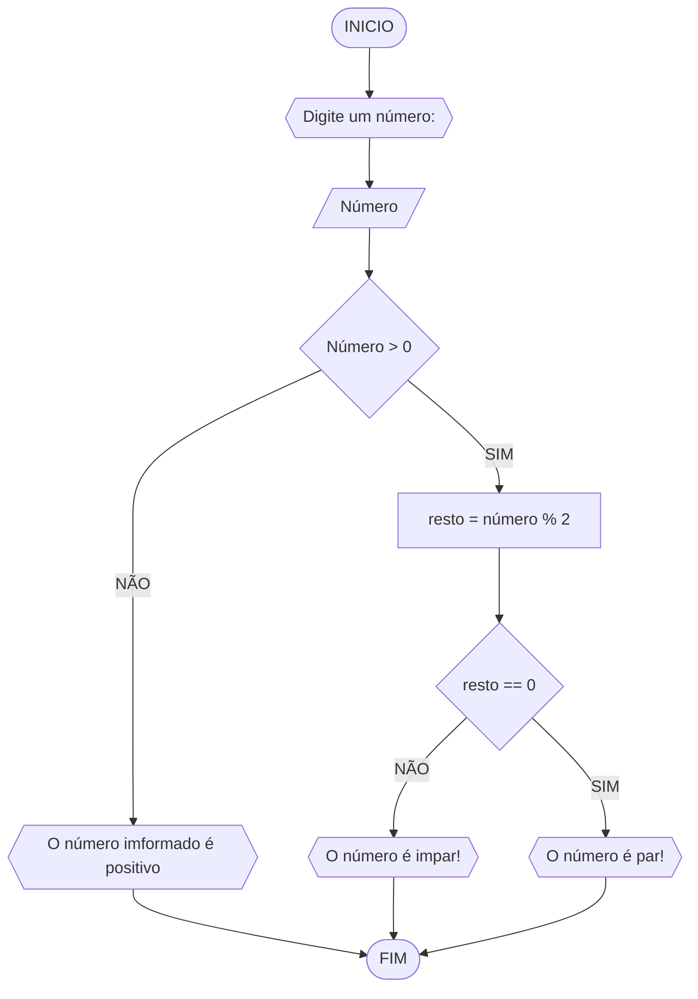

# UNIFOR
**Disciplina:** Raciocínio Lógico Algoritmo 
**Orientador:** Prof. Ricardo Carubbi

## Lista de Exercícios 

### Exercício 03

Represente, um fluxograma e pseudocódigo, um algoritmo para determinar se um número inteiro e positivo é par ou impar. 

### Fluxograma

## Pseudocódigo 
```
1 ALGORITIMO verifica_par_impar
2 DECLARE número, resto Numerico
3 ESCREVA "Digite um número:"
4 LEIA número
5 SE número > 0 ENTAO
6    resto = numero % 2
7    Se resto == 0 ENTAO
8       Escreva "O número é par!"
9    SENAO
10      ESCREVA "O número é impar!"
11   SENAO 
12      ESCREVA " O número deve ser positivo!"
13FIM_ALGORITIMO
```

